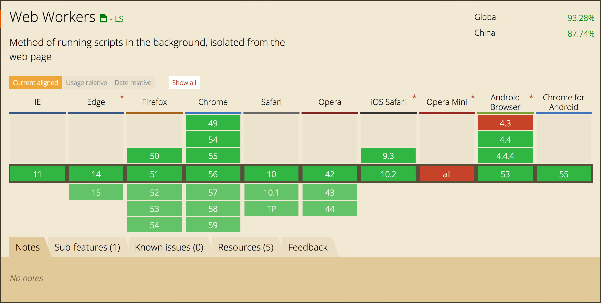

# get-skills  
这是本人用来学习一些新技术所建立的学习代码库，以下是代码库中所涉及的技术列表

## technology
一.Web Worker *<a href="https://qiutc.me/post/the-multithread-in-javascript-web-worker.html">教程</a>*   

 1.**Worker**  
 
&ensp;&ensp;web worker是在html5新规范中提供并被实现用来执行js多线程任务的一种技术，不过与传统的多线程的不一样的是，主线程和web worker中的Worker
线程、Worker线程之间是不会共享任何作用域或资源，他们间唯一的通信方式就是一个基于事件监听机制的 message  

&ensp;&ensp;注意：worker进程是不包含全局变量window和访问dom的api，因此只能进行纯JS的计算，
  但是浏览器也为其提供了一些可访问的属性和函数，具体如下：  
  1.    *setTimeout()*， *clearTimeout()*， *setInterval()*， *clearInterval()*：有了设计个函数，就可以在 Worker 线程中执行定时操作了；
  2.    *XMLHttpRequest* 对象：意味着我们可以在 Worker 线程中执行 ajax 请求；
  3.    *navigator* 对象：可以获取到 ppName，appVersion，platform，userAgent 等信息；
  4.    *location* 对象（只读）：可以获取到有关当前 URL 的信息；
  
  
  另外，Worker提供了importScripts()来加载外部脚本到当前Worker中  
  一个tab页对应了只能由一个worker  
  2.**SharedWorker**  
  &ensp;&ensp;SharedWorker 提供了让多个页面享用同一个Worker的脚本线程（*满足同源策略*）,目前大部分浏览器未实现  
  
  Web Worker 浏览器兼容性：  
  
  
---------  

二. **jsonp**    
&ensp;&ensp;实现原理：基于script标签的请求方式，前台请求时向后台传递执行的方法名，后台拼装成请求数据作为参数的函数调用，因为是script的请求方式，前台接受数据时会当js执行（类似于eval 执行)  

--------- 

三. **BigInt** *<a href="https://zhuanlan.zhihu.com/p/36330307">教程</a>* (*待更新，目前只能在chrome67中支持，提案进入stage-3，只实现了syntax,未实现transform*)  

---------

四. **ECMAScript Features**  
&ensp;&ensp;ES的新特性学习，清单如下：  
 1.Symbol*<a href=''>教程</a>*